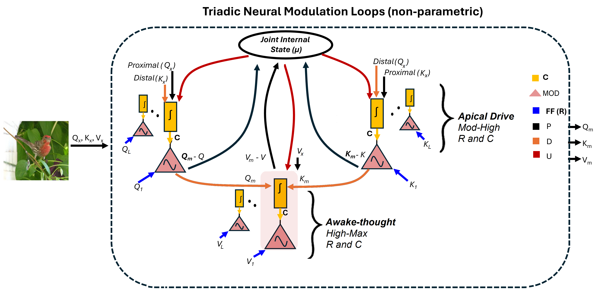
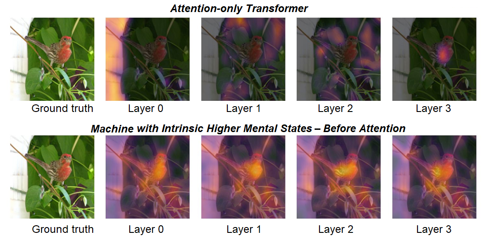
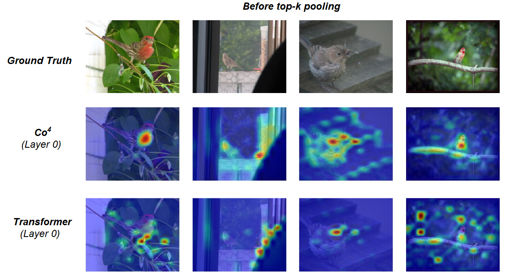

  

# Scalable Machines with Intrinsic Higher Mental-State Dynamics

  

## 🌐 Overview 

Reference implementation of **Scalable Machines with Intrinsic Higher Mental-State Dynamics**: Co⁴ architecture.

This repository is released as an **open research platform** rather than a finalized architecture to support reproducible research, transparent experimentation, and community-driven development. The implementation closely follows the formulation described in the accompanying paper and is intended to serve as a minimal, transparent reference implementation of the proposed mechanism.

The repository includes:

- Training scripts  
- Evaluation pipelines  
- Configuration files  
- Pretrained checkpoints corresponding to the experiments reported in the paper

---

## Reproducing the Main Results

The default implementation corresponds to Equations (7–9) in the paper where latent Q, K, V tokens are initialized from normal distributions. Running the provided training scripts reproduces the results reported in the paper for vision experiments. For RL experiments, Equations (10–12) have been used.

The codebase can also reproduce the Co⁴-MLP variant, which simply feeds the modulated $V$ tokens into an MLP block, removing attention entirely.

To run this configuration:

- Implement Equations (10–12)
- Initialize latent tokens directly from input projections

For experimentation with the joint internal state μ, the belief-state update described in Equation (1) can optionally be implemented.

---

## Contact

For questions, issues, or collaboration inquiries:

TREND@stir.ac.uk

## 🧠 Core idea

Standard Transformer architectures primarily compute relevance through attention, often relying on deep stacks and quadratic attention complexity. In contrast, the Co⁴ architecture, which implements principles underlying awake imaginative dynamics, enables the model to:

- generate internal predictions that pre-select relevant information prior to attention through neuronal-level triadic Q–K–V modulation loops.
- enforce contextual coherence at the representation level before attention is applied.
- accelerate learning while reducing computational demand (e.g., fewer heads, layers, and tokens)
- approximate near-linear scaling behaviour with respect to the number of input tokens $N$

**Downstream Readout After Coherence Establishment**

Once Co⁴ establishes coherence — separating relevant (coherent) tokens from irrelevant (incoherent) ones, the exact downstream readout operator (e.g., pruning, gating, or MLP in place of attention) becomes less critical and can be selected based on design priorities. 

**Example Design Choices**

- **MLP-only routing (no attention)**: Replacing attention entirely with a simple MLP applied to modulated _V_ yields strictly _O(N)_ complexity.
- **Top-_k_ attention over coherent tokens**: Using top-_k_ relevant tokens for attention operates at an approximate computational complexity of $\mathcal{O}(N + k^2)$, where _N_ denotes the number of input tokens and $k$ denotes the selected top-_k_ coherent tokens. Since $k \ll N$ and $k \le \sqrt{N}$, the model exhibits near-linear scaling in $N$.

**Empirical Behaviour**

Both readout approaches yield substantially faster learning with reduced computational demand in Co⁴ compared to a standard Transformer under identical or smaller total parameter counts and the same training schedule. 

**Empirical observation:**

- Reducing the top-_k_ tokens improves performance in Co⁴.
- Applying the same top-_k_ feature selection to ViT results in performance degradation.
  
This behaviour contrasts with the commonly reported behaviour of standard Transformer-based models, which often benefit from increased context length.

## 📊 Reproducing key results

The repository includes scripts for reproducing experiments reported in the paper:

- CIFAR-10
- Tiny-ImageNet
- Mini-ImageNet
- ImageNet-1K (early scaling)
- CartPole
- PyBullet Ant
- Acrobot
- MountainCar
- CarRacing

These correspond to:

- Figure 4 (vision experiments)
- Figure 5 (RL experiments)
- Table 1–4 (ablation and scaling results)

## 🏗️ Architecture
The specific form of the triadic modulation loops and the _R–C_ integration strategies may vary across datasets and hyperparameter configurations. For example, Figure 1(b) represents one of the architectural variants evaluated in this paper, building on the basic architecture; other architectural instantiations are possible. The key element, however, is the cooperative modulation dynamics _(MOD(R, C))_ operating under distinct mental-state-dependent processing regimes 

## Latent Triadic Modulation Mechanism

Latent $Q_{\text{L}}$, $K_{\text{L}}$, and $V_{\text{L}}$ tokens are initialized from a random distribution and serve as feedforward (FF) inputs i.e., receptive fields (R). Contextual input, including $Q_X$, $K_X$, and $V_X$ are FF contextual projections that assume proximal (P) or distal (D) roles relative to the active TPN population, whereas $\mu$ functions as universal (U) context and provides the recurrent feedback within the iterative dynamics. The TPN-like circuits governing $Q_m$, $K_m$, and $V_m$ then evolve via MOD dynamics determined by the relative magnitudes of $R$ and $C$ inputs, corresponding to the neurobiological apical drive (AD) and AD + awake processing regimes. The resulting modulated representations $Q_m$, $K_m$, and $V_m$ are subsequently selected and passed to the self-attention block, or alternatively, $V_m$ is simply passed to an MLP layer.

## Gradient Flow  
Different modulatory cooperation laws Φ(𝑅,𝐶) reshape the cooperation surface and its gradient field ∇Φ(𝑅,𝐶) over the 𝑅−𝐶 space. Changes in contextual and receptive-field strength move the system between apical isolation, apical amplification, apical drive, and AD+Awake regimes, producing corresponding deformations in the geometry of gradient flow. By shaping representations prior to attention, these modulation laws guide gradients along coherent R–C interaction manifolds, reducing propagation through noisy or irrelevant directions. This structured learning geometry helps explain the faster convergence and improved learning efficiency observed in Co4 compared to standard Transformers, where gradients propagate without such context-conditioned modulation.

## Object Classification 

Early training comparison between an attention-only ViT _(Dosovitskiy et al., 2020)_, trained from scratch, and a Co⁴ machine endowed with intrinsic mental-state-dependent processing regimes that pre-select relevant information _before_ attention is applied. The task is to identify a bird from the Mini-ImageNet dataset. In the ViT model, brightness indicates regions emphasized after attention. In contrast, Co⁴ rapidly forms a coherent interpretation of the input, highlighting the top-_k_ salient regions via internally generated awake imaginative regimes _before_ attention is computed. Co⁴ exhibits earlier and sharper activation over the semantically relevant object (bird), indicating more coherent internal inference. Faster early-stage learning is observed for Co⁴. These findings raise questions about the necessity of deep attention stacks.

The figure visualizes the complete attention distribution over _N_ input tokens: Single-layer Co⁴ machine vs. an attention-only ViT _(Dosovitskiy et al., 2020)_, both trained on Mini-ImageNet for 30 epochs. The ViT exhibits more dispersed attention with less selective localization. In contrast, Co⁴ demonstrates more centered, context-sensitive activation patterns, indicating stronger spatial coherence.

## Reinforcement Learning
### 🎥 Demo

<!--<video src="https://github-production-user-asset-6210df.s3.amazonaws.com/122742805/546751693-1b619473-1e64-405b-ae85-c0d4dc1ea571.mp4"
       controls
       muted
       loop
       playsinline
       width="100%">
</video>
-->

https://github.com/user-attachments/assets/892a8595-3071-4b2a-a9c7-d8e151ec111d

Comparison of a permutation-invariant Transformer (left) and the Co⁴ model (right), both trained for 100 episodes; Co⁴ reaches ~700 reward while transformer only reaches 245 reward.

## 📄 License
The source code is released under the [Creative Commons Attribution–NonCommercial 4.0 International (CC BY-NC 4.0)](https://creativecommons.org/licenses/by-nc/4.0/) license, permitting reuse and modification for research and academic purposes while restricting commercial use — see the [LICENSE](LICENSE) file for details.

## Citation

If you use this code in your research, please cite:

@article{adeel2026co4,
  title={Scalable Machines with Intrinsic Higher Mental States},
  author={Adeel, Ahsan et al.},
  year={2026},
  journal={arXiv preprint}
}

