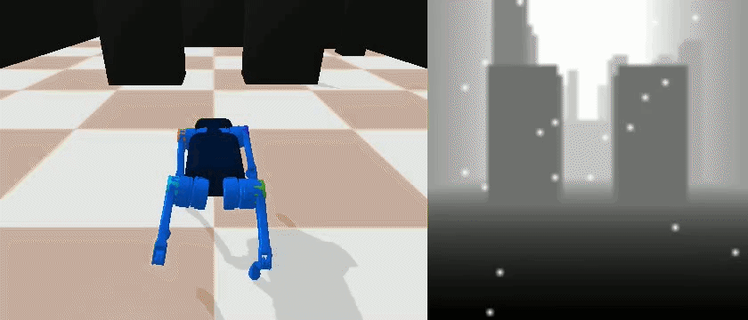
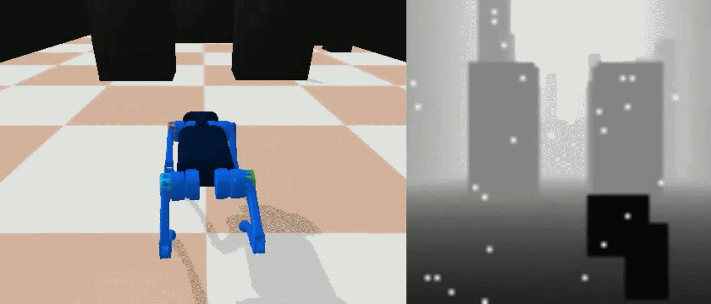
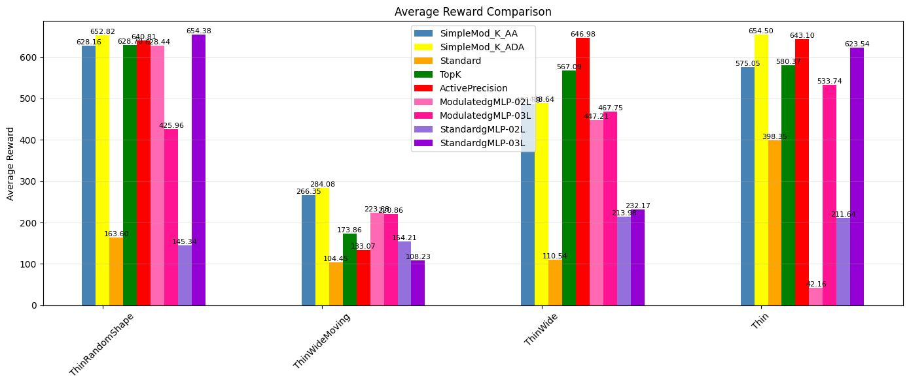
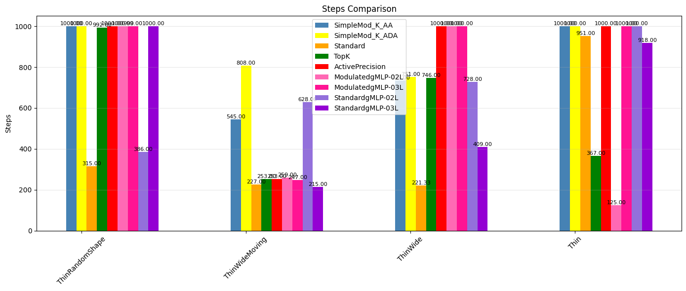
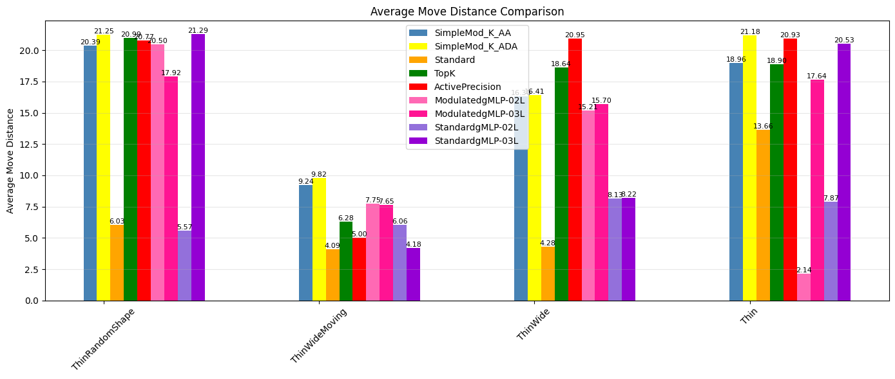

---

## 📂 Architecture and Ablation Variants

This repository contains several architectural variants and robustness experiments built on top of the core **LocoTransformer** and **MMDR** frameworks. Each subdirectory contains its own isolated implementation and a dedicated `README.md` with specific run instructions.

Here is a quick overview of what is happening in each subdirectory:

### `Original Implementation`

This folder contains the unmodified base architectures exactly as presented in the LocoTransformer and MMDR papers. It uses standard Cross-Modal Transformers to fuse proprioceptive state data with visual depth maps, serving as the primary baseline for all other experiments and ablation studies in this repository. The directory also contains the implementation of $CO^4$ as well.


| Standard | Modulated |
|:---:|:---:|
|  |  |


# Attention Layer Visualisation

| Standard | Modulated |
|:---:|:---:|
|  |  |

### `TopK Implementation`

This directory implements a **sparse attention mechanism** (Top-K routing). Instead of computing attention scores across all patches of the depth image, the network selectively attends only to the top K most salient features. This significantly reduces computational overhead while maintaining navigation performance.

| Standard | Modulated-TopK |
|:---:|:---:|
|  |  |

### `Gated MLP`

This variant replaces the standard Multi-Layer Perceptrons (MLPs) in the policy network with **Gated MLPs**. Gating mechanisms allow the network to selectively activate or suppress different information pathways based on the current state. This typically improves the robot's ability to learn complex, nonlinear representations of uneven terrain, often yielding more stable gaits in highly constrained environments. gMLP is placed to replace $O(N^2)$ attention cost.

| Standard | Modulated-gMLP |
<!-- |:---:|:---:|
|  |  | -->

### `Active Precision`

This directory focuses on `Active Precision` implementation by scaling the precision based on the environment's immediate local error.

| Standard | Modulated-AP |
|:---:|:---:|
|  |  |

### `Occluded Vision`

Robustness to sensor failure is vital for real-world deployment. Building upon the "simulate_realsense" blinding spots mentioned in the MMDR framework, this directory trains and evaluates policies under **partial observability**. The visual inputs are artificially masked, delayed, or heavily occluded during training to force the reinforcement learning agent to rely more heavily on its proprioceptive reflexes when its vision is temporarily compromised.

| Standard | Modulated |
|:---:|:---:|
|  |  |

## Creating the Environment

 Create and activate the Conda environment:

```
conda create -n vision4leg-3.9 python=3.10
conda activate vision4leg-3.9
```

 Install the required dependencies:

```
pip install -r requirements.txt
```


## 🚀 Training & Evaluation

All trained model checkpoints, architecture implementations, and experiment logs are stored and output under the **`log_mpc`** (or `log_rl`) directory by default. 

### Training a Model

To train a policy from scratch in simulation, use the `ppo_locotransformer.py` script. The following command launches a standard distributed training run:

```bash
python starter/ppo_locotransformer.py \
  --seed 0 \
  --vec_env_nums 16 \
  --proc_nums 16 \
  --eval_worker_num 16 \
  --config config/mpc/locotransformer/thin-wide.json \
  --save_dir log_mpc \
  --log_dir log_mpc \
  --id Thin_Wide_Static_SimpleMod_K_AA_02L_RL_contacttrue1 \
  --overwrite

```

**Understanding the Command:**

* `--seed 0`: Sets the random seed for reproducibility across environments and network initialization.
* `--vec_env_nums 16`: Number of parallel vectorized environments the training loop manages.
* `--proc_nums 16`: Number of CPU worker processes allocated for parallel simulation rollouts.
* `--eval_worker_num 16`: Dedicated worker threads explicitly for evaluating the policy's performance during training.
* `--config ...`: Path to the JSON file that defines the environment (e.g., static `thin-wide` obstacle course), task configuration, and reward structure.
* `--save_dir` & `--log_dir`: Target directories where TensorBoard logs, checkpoints, and final model weights will be saved.
* `--id`: A unique string identifier for this specific training run to avoid mixing checkpoints.
* `--overwrite`: If the specified `--id` log directory already exists, this flag forces an overwrite.
PS: Use 16 at minimum or 32 at max. If you want to change to something more, please dont exceed 512, since its the 'mini_batch' size being used. More workers means faster training.
### Evaluating a Model (Inference)

To evaluate a trained policy and generate video rollouts of the quadruped traversing the environment, use the `locotransformer_diff_env.py` script:

```bash
python starter/locotransformer_diff_env.py \
  --config config/mpc/locotransformer/thin-wide.json \
  --save_dir DiffVideo/ \
  --video_dir DiffVideo \
  --log_dir log_mpc \
  --id Thin_Wide_SimpleMod_K_AA_02L_OriginalReward \
  --add_tag _ThinWide \
  --env_name A1MoveGroundMPC \
  --seed 0 \
  --env_seed 1

```
PS: Evaluation occurs at different seeds to take mean of the performance. So it will run the evaluation 5 times.

**Understanding the Command:**

* `--config ...`: Should match the environment configuration the model was originally trained on.
* `--save_dir` & `--video_dir`: Target directory where the evaluation outputs and rendered MP4 videos of the simulation will be stored.
* `--log_dir log_mpc`: The root directory to load the pre-trained model checkpoint from.
* `--id`: The exact experiment identifier/folder name of the trained policy you want to evaluate.
* `--add_tag _ThinWide`: Appends a custom string to the output files for easier organization and searchability.
* `--env_name A1MoveGroundMPC`: Specifies the PyBullet Gym task environment to spawn for evaluation.
* `--seed 0`: The random seed for the policy/actions.
* `--env_seed 1`: The environment's procedural generation seed, ensuring that obstacles and terrains are generated in a specific, repeatable layout.

```

```

## Model Comparison — ThinWide

The following comparisons evaluate the different models across the available environments, with **all models trained exclusively on the `ThinWide` configuration**.

### Average Reward

<p align="center">
  
</p>

### Average Steps

<p align="center">
  
</p>

### Average Distance Moved

<p align="center">
  
</p>


## 📝 Notes

* **Best Configurations Only:** Only the best-performing model configurations and checkpoints are included for now.
* **Simulation Configuration:** There is no direct command-line option to modify the simulation behavior, though visual observation sampling frequency can be adjusted directly inside the config files via the `"get_image_interval"` parameter.
* **Training Curves:** Training curves and TensorBoard progress plots have not been added here yet.

<!-- # ---

# ### Variant Comparison Summary

# | Implementation | Primary Goal | Compute Cost | Ideal Use Case |
# | --- | --- | --- | --- |
# | **Original** | Baseline performance | Moderate | Benchmarking against official paper results |
# | **TopK** | Inference speed | Low | High-frequency control loops on edge hardware |
# | **Gated MLP** | Representation capacity | High | Complex, highly variable obstacle courses |
# | **Active Precision** | Adaptive efficiency | Variable | Long-range navigation with mixed terrains |
# | **Occluded Vision** | Sensor robustness | Moderate | Environments with high glare, dust, or sensor noise | -->