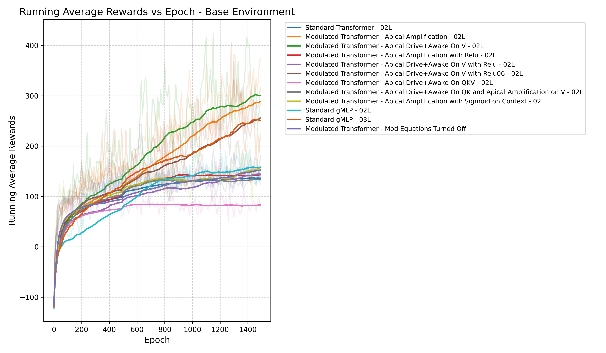
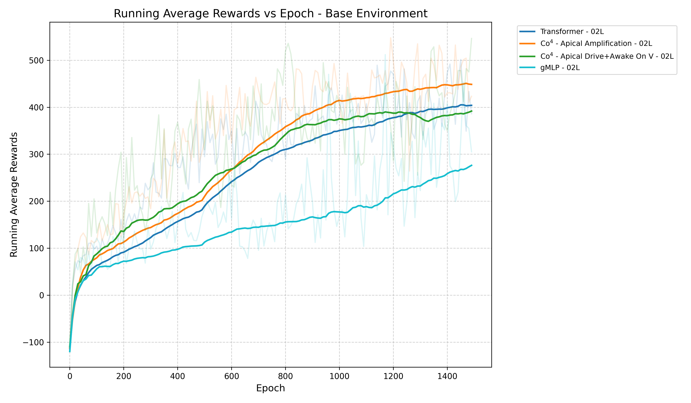
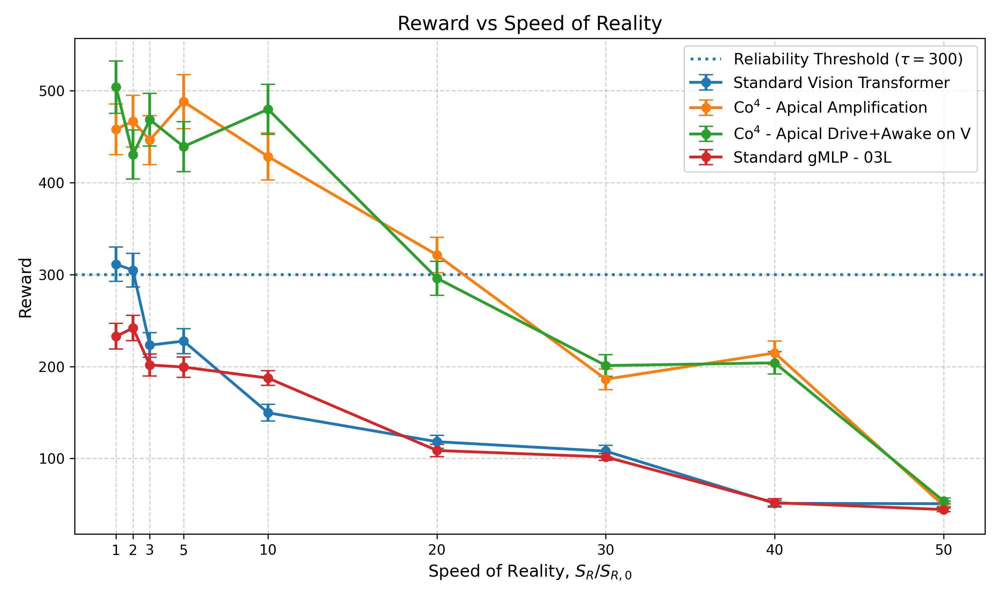
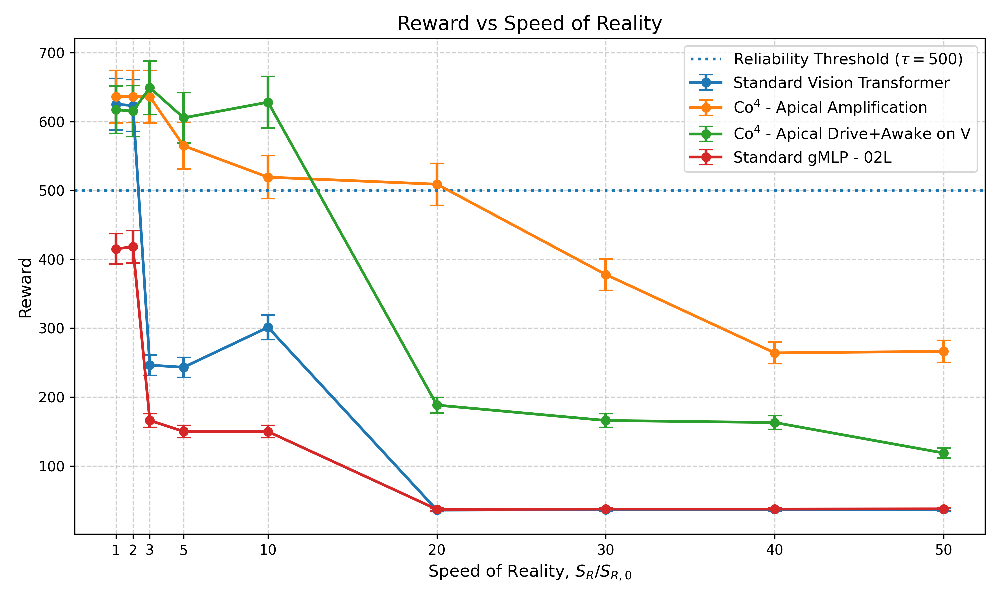

---
### When Reality Outpaces Cognition: *A New Scaling Principle for AI*

This repository contains the implemntation of Vision Guided Quadrupedal Locomotion trained on Baseline Transformer, gMLP and $CO^4$.

## 📂 Architecture and Ablation Variants

This repository contains several architectural variants and robustness experiments built on top of the core **LocoTransformer** framework. Each subdirectory contains its own isolated implementation and a dedicated `README.md` with specific run instructions.

Here is a quick overview of what is happening in each subdirectory:

### `Original Implementation`

This folder contains the unmodified base architectures exactly as presented in the LocoTransformer and MMDR papers. It uses standard Cross-Modal Transformers to fuse proprioceptive state data with visual depth maps, serving as the primary baseline for all other experiments and ablation studies in this repository. The directory also contains the implementation of $CO^4$ as well.


| Standard | Modulated |
|:---:|:---:|
|  |  |


# Attention Layer Visualisation

| Standard | Modulated |
|:---:|:---:|
|  |  |


### `Gated MLP`

This variant replaces the standard Multi-Layer Perceptrons (MLPs) in the policy network with **Gated MLPs**. Gating mechanisms allow the network to selectively activate or suppress different information pathways based on the current state. This typically improves the robot's ability to learn complex, nonlinear representations of uneven terrain, often yielding more stable gaits in highly constrained environments. gMLP is placed to replace $O(N^2)$ attention cost.


## Creating the Environment

 Create and activate the Conda environment:

```
conda create -n vision4leg-3.9 python=3.10
conda activate vision4leg-3.9
```

 Install the required dependencies:

```
pip install -r requirements.txt
```


## 🚀 Training & Evaluation

All trained model checkpoints, architecture implementations, and experiment logs are stored and output under the **`log_mpc`** (or `log_rl`) directory by default. 

### Training a Model

To train a policy from scratch in simulation, use the `ppo_locotransformer.py` script. The following command launches a standard distributed training run:

```bash
python starter/ppo_locotransformer.py \
  --seed 0 \
  --vec_env_nums 16 \
  --proc_nums 16 \
  --eval_worker_num 16 \
  --config config/mpc/locotransformer/thin-wide.json \
  --save_dir log_mpc \
  --log_dir log_mpc \
  --id Thin_Wide_Static_SimpleMod_K_AA_02L_RL_contacttrue1 \
  --overwrite

```

**Understanding the Command:**

* `--seed 0`: Sets the random seed for reproducibility across environments and network initialization.
* `--vec_env_nums 16`: Number of parallel vectorized environments the training loop manages.
* `--proc_nums 16`: Number of CPU worker processes allocated for parallel simulation rollouts.
* `--eval_worker_num 16`: Dedicated worker threads explicitly for evaluating the policy's performance during training.
* `--config ...`: Path to the JSON file that defines the environment (e.g., static `thin-wide` obstacle course), task configuration, and reward structure.
* `--save_dir` & `--log_dir`: Target directories where TensorBoard logs, checkpoints, and final model weights will be saved.
* `--id`: A unique string identifier for this specific training run to avoid mixing checkpoints.
* `--overwrite`: If the specified `--id` log directory already exists, this flag forces an overwrite.
PS: Use 16 at minimum or 32 at max. If you want to change to something more, please dont exceed 512, since its the 'mini_batch' size being used. More workers means faster training.
### Evaluating a Model (Inference)

To evaluate a trained policy and generate video rollouts of the quadruped traversing the environment, use the `locotransformer_diff_env.py` script:

```bash
python starter/locotransformer_diff_env.py \
  --config config/mpc/locotransformer/thin-wide.json \
  --save_dir DiffVideo/ \
  --video_dir DiffVideo \
  --log_dir log_mpc \
  --id Thin_Wide_SimpleMod_K_AA_02L_OriginalReward \
  --add_tag _ThinWide \
  --env_name A1MoveGroundMPC \
  --seed 0 \
  --env_seed 1

```
PS: Evaluation occurs at different seeds to take mean of the performance. So it will run the evaluation 5 times.

**Understanding the Command:**

* `--config ...`: Should match the environment configuration the model was originally trained on.
* `--save_dir` & `--video_dir`: Target directory where the evaluation outputs and rendered MP4 videos of the simulation will be stored.
* `--log_dir log_mpc`: The root directory to load the pre-trained model checkpoint from.
* `--id`: The exact experiment identifier/folder name of the trained policy you want to evaluate.
* `--add_tag _ThinWide`: Appends a custom string to the output files for easier organization and searchability.
* `--env_name A1MoveGroundMPC`: Specifies the PyBullet Gym task environment to spawn for evaluation.
* `--seed 0`: The random seed for the policy/actions.
* `--env_seed 1`: The environment's procedural generation seed, ensuring that obstacles and terrains are generated in a specific, repeatable layout.

**Changing the Frame Capture Speed**

Changing the speed of logic can be found in config file for `MPC` and `RL` config as *`get_frame_interval`*. Changing the frame interval from 1 to 50, causes frames to get skipped.


# Complicated Environment
## Training Curve

Figure [1](#fig-training-thinwide) shows the training curves for models trained in the `ThinWide` (Complicated) environment. The curves illustrate how the average reward changes throughout training and provide an overview of the learning behaviour and convergence of the different models.

<p align="center" id="fig-training-thinwide">
  
</p>

**Figure 1:** Training curves for models trained on the `ThinWide` (Complicated) environment.


## Performance on 10x
| Standard Transformer | Modulated  - Apical Amplification |
|:---:|:---:|
|  |  |

| Standard gMLP | Modulated - Apical Drive+Awake |
|:---:|:---:|
|  |  |

**Easy Environment (Thin-RandomShape)**

Figure [2](#fig-training-randomshape) shows the corresponding training curves for models trained in the `Thin-RandomShape` (Easy) environment. Compared with Figure 1, this provides a reference for how the models learn in the simpler environment.

<p align="center" id="fig-training-randomshape">
  
</p>

**Figure 2:** Training curves for models trained on the `Thin-RandomShape` (Easy) environment.


## Model Comparison
Changing the speed of reality ($S_R$) from 1 frame per step to 50 frames per step shows how model behaves when placed in a fast changing environment. 

<p align="center" id="fig-sr-curve-thin-wide">
  
</p>

**Figure 3:** $S_R$/$S_C$ curves for models trained on the `Thin-Wide` (Complicated) environment with 1x and evaluated uptil 50x.
Figure [3](#fig-sr-curve-thin-wide) compares how model's performance vary when changing the speed of reality.

The following figures compare the performance of the different models across the available evaluation environments. Importantly, **all models were trained exclusively using the `ThinWide` configuration**, allowing differences in performance to be attributed to the model architecture and its ability to generalise across environments.

### Average Reward

Figure [4](#fig-avg-reward) compares the average reward achieved by each model across the evaluated environments. Higher reward indicates better task performance under the corresponding evaluation conditions.

<p align="center" id="fig-avg-reward">
  
</p>

**Figure 4:** Average reward across evaluation environments for models trained on `ThinWide`.

### Average Steps

Figure [5](#fig-avg-steps) shows the average number of steps taken by each model. This provides an indication of how efficiently the models complete the task, with fewer steps generally corresponding to more direct trajectories when successful task completion is maintained.

<p align="center" id="fig-avg-steps">
  
</p>

**Figure 5:** Average number of steps across evaluation environments for models trained on `ThinWide`.

### Average Distance Moved

Figure [6](#fig-avg-distance) presents the average distance travelled by each model across the evaluation environments. This metric provides an additional measure of movement efficiency and can help distinguish between models that achieve similar rewards but follow different trajectories.

<p align="center" id="fig-avg-distance">
  
</p>

**Figure 6:** Average distance moved across evaluation environments for models trained on `ThinWide`.


# Easy Environment
## Training Curve


Figure [1](#fig-training-randomshape) shows the corresponding training curves for models trained in the `Thin-RandomShape` (Easy) environment. Compared with Figure 1 of Complicated Environment, this provides a reference for how the models learn in the simpler environment.

<p align="center" id="fig-training-randomshape">
  
</p>

**Figure 1:** Training curves for models trained on the `Thin-RandomShape` (Easy) environment.


## Model Comparison
Changing the speed of reality ($S_R$) from 1 frame per step to 50 frames per step shows how model behaves when placed in a fast changing environment. 

<p align="center" id="fig-sr-curve-thin-randomshape">
  
</p>

**Figure 2:** $S_R$/$S_C$ curves for models trained on the `Thin-RandomShape` (Easy) environment with 1x and evaluated uptil 50x.
Figure [2](#fig-sr-curve-thin-randomshape) compares how model's performance vary when changing the speed of reality.

The following figures compare the performance of the different models across the available evaluation environments. Importantly, **all models were trained exclusively using the `Thin-RandomShape` configuration**, allowing differences in performance to be attributed to the model architecture and its ability to generalise across environments.


## 📝 Notes

* **Best Configurations Only:** Only the best-performing model configurations and checkpoints are included for now.
* **Simulation Configuration:** There is no direct command-line option to modify the simulation behavior, though visual observation sampling frequency can be adjusted directly inside the config files via the `"get_image_interval"` parameter.
* **Simulation on Easy Configuration:** Due to simpler environment, no simulation on varying speed of reality is conducted.
* **Results Configuration: ** All results are trained on `MPC` configuration, due to model finding loopholes in rewards, no `RL` configuration has been tested yet. No simulation was ever trained on `get_frame_interval` more than 1, it was **always** evaluated at varying speed.


<!-- # ---

# ### Variant Comparison Summary

# | Implementation | Primary Goal | Compute Cost | Ideal Use Case |
# | --- | --- | --- | --- |
# | **Original** | Baseline performance | Moderate | Benchmarking against official paper results |
# | **TopK** | Inference speed | Low | High-frequency control loops on edge hardware |
# | **Gated MLP** | Representation capacity | High | Complex, highly variable obstacle courses |
# | **Active Precision** | Adaptive efficiency | Variable | Long-range navigation with mixed terrains |
# | **Occluded Vision** | Sensor robustness | Moderate | Environments with high glare, dust, or sensor noise | -->